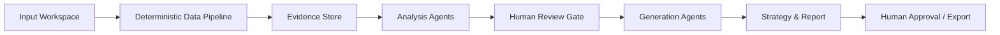
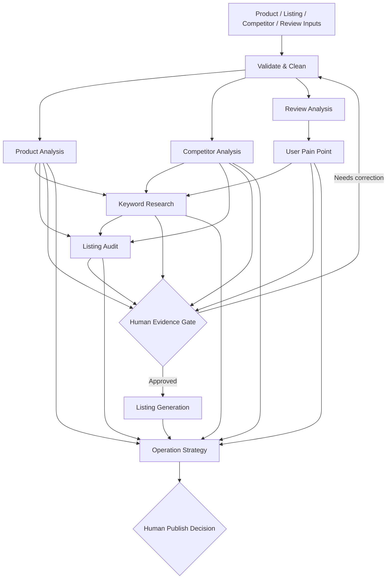
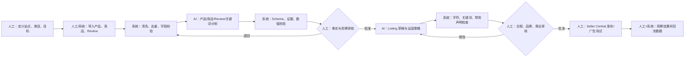

# Amazon AI 运营分析助手：GitHub 研究与产品设计

> 研究日期：2026-08-12  
> 范围：产品研究与系统设计，不包含代码。  
> 证据标记：**[仓库事实]** 来自可访问的 GitHub 页面；**[设计建议]** 是基于研究重新设计；**[不确定]** 表示无法从仓库直接验证。

## 0. 结论摘要

这个求职项目的最佳 MVP 不是“全自动 Amazon 运营平台”，而是一个**证据驱动、可追溯、有人审的分析工作台**：导入产品、竞品和 Review 数据，经过清洗后生成竞品矩阵、Review 主题与痛点、Listing 诊断、关键词分层、Listing 草稿和运营行动清单。

核心设计原则：

1. 数据与观点分开：每个结论必须携带 `evidence_ids`、`confidence` 和 `inference_type`。
2. 未知值保持未知：精确搜索量、销量、PPC 花费、市场份额等没有可靠来源时必须为 `null`，不能由模型估算成事实。
3. 分析与生成分开：先完成产品、竞品、Review、关键词分析，再生成 Listing。
4. Agent 是职责边界，不一定是独立模型：MVP 使用一个模型、多个版本化 Prompt 和确定性编排即可。
5. JSON 是机器接口，Markdown/仪表盘是人类界面；禁止让下游 Agent 解析上游自然语言报告。
6. 人工审核是发布闸门：合规、品牌事实、关键词数据、最终文案和运营决策不能完全自动化。

---

# 1. GitHub 项目研究结果

## 1.1 仓库识别与可访问性

| 用户给出的名称 | 核验结果 | 本次采用的代表仓库 | 说明 |
|---|---|---|---|
| Amazon-Skills | 可访问，但名称不唯一 | [nexscope-ai/Amazon-Skills](https://github.com/nexscope-ai/Amazon-Skills)、[zach22-1999/amazon-skills](https://github.com/zach22-1999/amazon-skills) | 搜索还会混入 Alexa Skills，不能混为一谈。本次深读前者的核心 `SKILL.md`。|
| eCommerce-Skills | 可访问，但名称不唯一 | [nexscope-ai/eCommerce-Skills](https://github.com/nexscope-ai/eCommerce-Skills) | GitHub 搜索存在多个近名项目；该仓库与 Amazon-Skills 同属 Nexscope，定位更宽。|
| Amazon Product Analyzer | 可访问，但名称不唯一 | [brightdata/amazon-product-analyzer](https://github.com/brightdata/amazon-product-analyzer)、[Noahzaidi/Amazon-Products-Analyzer](https://github.com/Noahzaidi/Amazon-Products-Analyzer) | 前者是数据抓取、仪表盘和 Gemini 洞察；后者偏 Jungle Scout CSV/FBA 数据分析。|
| Amazon Reviews / Sentiment Analysis | 类别可访问，不是单一项目 | [avivace/reviews-sentiment](https://github.com/avivace/reviews-sentiment)、[ishikaarora/Aspect-Sentiment-Analysis-on-Amazon-Reviews](https://github.com/ishikaarora/Aspect-Sentiment-Analysis-on-Amazon-Reviews)、[mandeep147/Amazon-Product-Recommender-System](https://github.com/mandeep147/Amazon-Product-Recommender-System) | 代表主题建模、方面级情感分析、传统情感分类。许多项目较旧，且并非 LLM Prompt 项目。|

未发现用户所指每个名称的唯一官方仓库，因此本文不声称这些名称对应唯一实现。

## 1.2 Amazon-Skills：值得学习什么

**[仓库事实]** `nexscope-ai/Amazon-Skills` README 在访问时列出 53 个面向 Amazon 卖家的纯文本 Agent Skills。与本项目直接相关的目录包括 `amazon-product-research`、`amazon-competitor-analysis`、`amazon-review-analyzer`、`amazon-listing-optimization`、`amazon-keyword-research`、`amazon-backend-keywords`、`amazon-ppc-campaign` 等。

### 核心 Skill 对照

| Skill | Role | Context | Task | Rules | Output | Quality Control |
|---|---|---|---|---|---|---|
| Listing Optimization | Listing builder/auditor | 产品特征、关键词、竞品 ASIN、站点、语气、现有 Listing | Create/Optimize 两模式；关键词收集→分层→产品信息→生成→覆盖率；或抓取→关键词缺口→8 维审计→改写 | Title/Bullet/Description 长度；禁用夸大词；关键词自然植入；站点语言一致 | 可复制 Listing + Markdown 诊断、覆盖表、前后对比 | 字符计数、关键词覆盖率、8 维评分；但评分主观，缺少严格 Schema 与事实级证据引用 |
| Keyword Research | Amazon keyword researcher | Seed keyword、marketplace、Autocomplete、竞品、趋势 | Autocomplete 扩展→竞品环境→季节性→机会评分 | 声明无法提供精确月搜索量；多站点分别运行；按意图区分 | Markdown：长尾分类、竞品指标、趋势、机会评分 | 明示数据限制；但竞品数、均价、机会分仍可能受抓取样本影响，缺少 `source_id/confidence` |
| Competitor Analysis | Competitive intelligence analyst | ASIN/类目、Listing、价格、Review、广告可见性 | 数据收集→多维比较→战略建议 | 同价位/细分类目比较；从客户视角；输出行动项 | 竞品矩阵 + 战略建议 + Next Actions | 明示价格是时间点快照、Review 是可见样本、PPC 是间接估计；没有结构化验证 |
| Review Analyzer | Review intelligence analyst | 多星级、近期 Review、竞品 Review、客户原话 | 收集→情感/主题→抱怨与需求→运营建议 | 多星级采样、近期优先、2–3 竞品、保留原话、按紧急/研发/营销分类 | 情感概览、抱怨表、Feature Requests、Competitive Intelligence、行动优先级 | 明示样本与历史数据限制；有频率/严重度，但没有稳定的主题编码、去重规则和证据 ID |

### Prompt 设计的优点

- Role 不是泛泛的“电商专家”，而是具体工作岗位，缩小回答空间。
- 工作流有明显顺序，尤其 Listing 的“先研究关键词，再生成文案”避免一步到位。
- 输出模板面向真实工作产物：Listing 可直接使用，诊断解释为什么。
- Review 分析从情感进一步走向投诉频率、Feature Request、竞品切换原因和行动项。
- 明确部分数据限制，是减少幻觉的重要起点。

### 不足与本项目的修正

- Markdown 表格适合阅读，不适合可靠串联 Agent；本项目改为 JSON Schema。
- “机会评分”“改写后评分”若无标定规则容易伪精确；本项目要求评分公式、输入覆盖率和置信度。
- Review 示例引用没有稳定 `review_id`；本项目强制证据可回溯。
- Autocomplete 是需求信号，不等同于搜索量；本项目不展示虚构 volume。
- 抓取脚本能否长期稳定受 Amazon 页面与使用条款影响；MVP 先支持 CSV/JSON 手工导入。

## 1.3 eCommerce-Skills

**[仓库事实]** `nexscope-ai/eCommerce-Skills` 的 GitHub 描述为面向 AI Agent 的电商 Skills，覆盖产品研究、营销自动化、供应链和商业分析。它的价值主要是展示如何按业务域建立 Skill 目录，而不是证明每项分析都拥有可靠实时数据。

对本项目的启发：

- 用运营任务命名能力，而不是用模型技术命名。
- Skill 可组合，但要有明确触发条件和输入前置条件。
- Amazon 专属规则与通用电商分析应分层：MVP 聚焦 Amazon Listing、Review、竞品、关键词，不扩展供应链/多平台。

## 1.4 Amazon Product Analyzer

**[仓库事实]** `brightdata/amazon-product-analyzer` README 展示 23 个 Amazon 市场、Bright Data Amazon Scraper API、Pandas、Plotly、Streamlit、Gemini，自然语言问答、价格/Rating 分布、Deal 检测、筛选和 CSV 导出。

值得学习：

- LLM 不是数据层：先获取和处理结构化数据，再让模型解释。
- 图表与原始表格并存，用户可以复核 AI 结论。
- Marketplace 是一级上下文，币种、价格、排名不可跨站点直接混合。
- 筛选与导出提升求职 Demo 的可信度。

不可直接继承的假设：

- 需要第三方 API Key，不适合零配置 MVP。
- README 展示的是功能流程，不等同于公开了完整 Prompt。
- “AI 推荐”必须显示所依据的数据范围和时间，不能作为事实判断。

## 1.5 Amazon Reviews / Sentiment Analysis 项目

**[仓库事实]** 搜索结果中的代表项目多为 Notebook/传统 NLP：情感分类（Logistic Regression、LSTM/GRU 等）、LDA 主题建模、方面级情感分析和可视化，而不是 Agent Prompt。

最重要的产品启发：

1. 仅做正/负情感不够。需要 `aspect × sentiment × frequency × severity × evidence`。
2. 主题建模可帮助发现高频主题，但自动主题标签仍需人工解释。
3. 星级与文本情感不一致应标记，而不是强制归类。
4. 训练集准确率不等于运营洞察质量；运营层还需问题可行动性和商业影响。
5. Review 去重、语言、时间范围、变体、Verified Purchase、样本分布都会影响结论。

---

# 2. 值得学习的 Prompt 设计

## 2.1 标准 Prompt 骨架

每个 Agent 都采用：

```text
Role → Context → Objective → Input Contract → Ordered Tasks
→ Evidence Rules → Business Rules → Output JSON → Quality Control
```

这比“你是 Amazon 专家，请分析”稳定，因为它同时约束：身份、数据边界、步骤、禁止项、机器接口和自检。

## 2.2 防幻觉规则

所有 Agent 共用以下 Rules：

1. 只使用输入对象和其 `source_records`；不得补充未提供的产品事实。
2. 数字必须来自 `source_id`；计算值标记 `derived` 并说明公式。
3. 无数据返回 `null`/空数组，并写入 `missing_fields`，不得用“通常”“行业平均”填补。
4. 区分 `fact`、`derived`、`inference`、`recommendation`。
5. 每个关键结论必须有至少一个 `evidence_id`；否则进入 `unsupported_claims`。
6. 频率必须包含分母，例如 `mention_count=18, sample_size=240`，不能只写“高频”。
7. 不把 Autocomplete 当搜索量；没有授权数据源时 `monthly_search_volume=null`。
8. 不把 Review 样本推断为全部买家；输出采样说明与偏差。
9. 不生成无法证明的合规、健康、安全、性能、排名或比较级声明。
10. 只输出符合 Schema 的 JSON；未知字段禁止出现。

## 2.3 稳定输出方法

- 枚举代替自由文本：`severity: low|medium|high|critical`。
- 数字与标签分开：`priority_score: 82` + `priority: high`。
- 固定 ID：`review_001`、`theme_003`、`pain_002`，用于跨 Agent 引用。
- 每个结果带 `schema_version`、`run_id`、`input_hash`、`generated_at`。
- 使用 `additionalProperties: false`，防止模型临时创造字段。
- 服务端做 JSON Schema 校验；失败时只执行一次“修复格式”重试，不重新分析事实。

---

# 3. Agent 拆解逻辑

## 3.1 超级 Prompt 与多 Agent

| 维度 | 方案 A：超级 Prompt | 方案 B：职责化 Agent |
|---|---|---|
| 可控性 | 上下文大、指令冲突、容易漏步骤 | 每步输入/输出固定，可单独验证 |
| 追溯性 | 结论来源混在长文本中 | 用 ID 和 evidence 链追踪 |
| 可测试性 | 很难定义单元测试 | 每个 Agent 有 Schema 和验收样例 |
| 成本/延迟 | 一次调用可能较低 | 多次调用更高，可缓存和并行部分步骤 |
| 错误传播 | 一处错误隐藏在最终报告 | Gate 可阻止错误进入生成阶段 |
| 迭代 | 改一处可能影响所有输出 | 独立版本化 Prompt |

方案 B 更好，不是因为“Agent 越多越高级”，而是因为运营任务有不同的数据要求、失败条件和评价标准。

## 3.2 职责边界

| Agent | 只负责 | 不负责 |
|---|---|---|
| Product Analysis | 将产品资料规范化并形成 feature→benefit 假设 | 市场事实、竞品优劣 |
| Competitor Analysis | 同口径竞品矩阵与差异机会 | 编造销量、市场份额、PPC 花费 |
| Review Analysis | Review 级分类、方面情感、主题聚合 | 直接生成 Listing |
| User Pain Point | 将主题转为可排序痛点与机会 | 重复读取原始 Review（只读上游证据） |
| Listing Audit | 诊断当前 Listing 与证据覆盖 | 改写 Listing |
| Keyword Research | 候选词分类、相关性、意图、来源、优先级 | 无来源的搜索量预测 |
| Listing Generation | 基于已批准事实/关键词生成草稿 | 新增产品事实或承诺 |
| Operation Strategy | 合并结果、排序行动与风险 | 覆盖人工商业判断 |

## 3.3 不必拆成 Agent 的环节

- CSV 解析、HTML 清理、去重、语言检测、字符计数：确定性代码/规则。
- JSON Schema 校验、ID 分配、Hash、排序：代码。
- 关键词是否出现在 Title/Bullet：字符串匹配与规范化。
- 报告拼装：模板渲染。
- MVP 的“Product Benefit Agent”不单独拆：并入 Product Analysis。

---

# 4. Amazon AI 助手架构

## 4.1 分层架构



1. Input Workspace：产品表单、当前 Listing、竞品 CSV、Review CSV、关键词 CSV。
2. Data Pipeline：字段映射、去重、缺失检查、语言/时间/星级分布。
3. Evidence Store：保存原文片段、来源、采集时间和记录 ID。
4. Analysis Agents：Product、Competitor、Review、Pain Point、Listing Audit、Keyword。
5. Human Review Gate：确认产品事实、证据主题和关键词来源。
6. Generation：Listing Generation。
7. Strategy：Operation Strategy 汇总优先级和下一步行动。

## 4.2 MVP 页面

1. Project Setup：Marketplace、类目、目标语言、产品资料。
2. Data Import：竞品与 Review CSV 映射、清洗预览、质量报告。
3. Analysis Workspace：竞品矩阵、Review 主题、痛点排序、证据抽屉。
4. Listing Workspace：当前/建议并排、字符数、关键词覆盖、风险提示。
5. Final Report：优势、差距、关键词、行动清单、JSON/Markdown 导出。

---

# 5. Agent 之间的数据流



传递规则：Agent 只接收需要的字段和证据 ID；不传整个聊天历史。上游结果不可被下游静默改写。发现冲突时写入 `conflicts` 并退回人工 Gate。

---

# 6. 每个 Agent 的 Prompt

以下为可直接版本化的模板。`{{...}}` 是编排器注入的 JSON。

## 6.1 Product Analysis Agent

**Role**：Amazon 产品信息分析员，只负责将卖家提供的信息规范化并建立“特征→功能→潜在利益”链。  
**Context**：`marketplace`、`category`、`product_input`、`source_records`。  
**Objective**：形成下游可使用且可追溯的产品事实底稿。

```text
INPUT: {{product_input_json}}
TASK:
1. 标准化产品类型、品牌、规格、材料、包装清单。
2. 提取 features 和 core_functions。
3. 基于明确特征提出 target_users、use_cases、potential_benefits；推断必须标记 inference。
4. 建立 feature_benefit_links，每条引用 evidence_ids。
RULES:
- 不把“潜在利益”改写成已验证性能。
- 缺少品牌、尺寸、材料、认证等写入 missing_fields。
- 禁止健康、安全、最佳、第一等无证据声明。
OUTPUT: 仅输出 ProductAnalysisResult JSON。
QUALITY CONTROL:
- 所有 fact 有 evidence_id。
- 每个 benefit 至少关联一个 feature；否则删除。
- 输出 unsupported_claims 与 conflicts。
```

为什么：Listing 生成最常见幻觉来自产品事实不完整；先建立批准事实库能约束所有下游文案。

## 6.2 Competitor Analysis Agent

**Role**：Amazon 竞品情报分析员。  
**Context**：目标产品、同 marketplace/类目的竞品快照、采集时间。  
**Objective**：同口径比较价格、Rating、Review、卖点、强弱项和差异机会。

```text
INPUT: {{product_analysis}}, {{competitor_records}}
TASK:
1. 验证竞品是否同站点、同细分用途、同价格带；标记不可比项。
2. 输出逐竞品事实矩阵：price/rating/review_count/claims/features。
3. 从 Listing 与 Review 证据分别提取 strengths/weaknesses，禁止混淆。
4. 生成差异化机会；每项说明证据、目标用户、可信度和风险。
RULES:
- 不估计销量、份额、PPC 花费；无可靠来源则 null。
- 价格必须包含 currency、captured_at。
- “弱点”必须由 Review/缺失事实支撑，不能仅因对方未写而断言产品没有。
OUTPUT: 仅输出 CompetitorAnalysisResult JSON。
QUALITY CONTROL:
- 比较维度一致；样本少于 3 个时标记 insufficient_sample。
- 所有机会至少引用两类证据，或将 confidence 降为 low。
```

为什么：竞品分析需要“事实矩阵”和“解释”分开，否则 AI 容易把页面缺失当作产品缺陷。

## 6.3 Review Analysis Agent

**Role**：Amazon Voice-of-Customer 分析员。  
**Context**：已清洗 Review、样本分布、语言、时间窗口、产品/竞品 ID。  
**Objective**：做 Review 级方面情感与主题聚合，产出可运营洞察。

```text
INPUT: {{review_dataset_manifest}}, {{review_records}}
TASK:
1. 对每条 Review 标注 sentiment、aspects、issue_type、use_case；允许 mixed/unclear。
2. 合并语义重复主题，保留 canonical_theme 与原始表达。
3. 计算每个主题 mention_count/sample_size/rate，并按星级、产品、时间切片。
4. 提取 praises、complaints、questions、feature_requests、return_triggers。
5. 每个聚合主题提供最多 3 条代表 evidence_ids。
RULES:
- 不把星级直接等同于文本情感。
- 不把一条 Review 拆成多个相同 mention 来抬高频率。
- 只引用输入中的原文；不得生成“典型评论”。
- 结论必须说明样本范围与偏差。
OUTPUT: 仅输出 ReviewAnalysisResult JSON。
QUALITY CONTROL:
- mention_count 不得大于 sample_size。
- 所有 quote 可由 review_id 回查。
- 主题总数受控，过细主题需合并；unclear 保留。
```

为什么：关键不是“总结 Review”，而是把证据聚合为方面、频率、严重性、场景和行动线索。

## 6.4 User Pain Point Agent

**Role**：用户需求与痛点优先级分析员。  
**Context**：ReviewAnalysisResult、产品能力、竞品差异。  
**Objective**：将 Review 主题转换为可决策的痛点/需求/产品机会。

```text
INPUT: {{review_analysis}}, {{product_analysis}}, {{competitor_analysis}}
TASK:
1. 将 complaint themes 聚合为 pain points，区分 quality/usability/expectation/compatibility/service。
2. 为每项计算 frequency_score、severity_score、business_impact_score、confidence。
3. 识别 underlying_need，不得把解决方案直接当需求。
4. 输出可行机会：product/listing/content/support；说明 owner 与验证方法。
RULES:
- Priority = 0.4*frequency + 0.35*severity + 0.25*business_impact；各项 0-100。
- 严重度依据退货、安全、无法使用、轻微不便等定义，不由语气强烈程度决定。
- 数据不足不输出高置信度机会。
OUTPUT: 仅输出 PainPointResult JSON。
QUALITY CONTROL:
- 每个 pain point 引用上游 theme_ids 和 evidence_ids。
- recommendation 不得超出产品能力；冲突进入 conflicts。
```

为什么：单独的一层能把“客户说了什么”与“企业应该做什么”解耦，也便于人工纠正优先级。

## 6.5 Listing Audit Agent

**Role**：Amazon Listing 诊断员。  
**Context**：当前 Listing、approved product facts、关键词候选、Marketplace 规则配置。  
**Objective**：定位 Title、Bullets、Description、Search Terms 的问题，不直接改写。

```text
INPUT: {{listing}}, {{approved_product_facts}}, {{keyword_result}}, {{policy_config}}
TASK:
1. 确定性指标：字符数、字段缺失、关键词覆盖、重复率由输入 metrics 读取。
2. 诊断 clarity/relevance/benefit_expression/evidence_support/keyword_naturalness。
3. 对每个 issue 输出 location、severity、evidence、recommended_change。
4. 标记 unsupported claims、事实冲突和潜在合规风险。
RULES:
- 不假设所有类目/站点规则相同，只使用 policy_config。
- 不以关键词堆砌提升评分。
- 图片、A+、价格数据缺失时不得评分。
OUTPUT: 仅输出 ListingAuditResult JSON。
QUALITY CONTROL:
- 分数必须由公开 rubric 计算；缺失维度为 null，不按 0 分。
- 每个问题定位到具体字段/句子。
```

为什么：诊断与生成分开后，用户能看见问题是否真实，避免“为了展示优化而制造问题”。

## 6.6 Keyword Research Agent

**Role**：Amazon 关键词分类与优先级分析员。  
**Context**：产品事实、竞品 Listing 词、Review 客户语言、Autocomplete/第三方数据及来源。  
**Objective**：形成核心、长尾、场景、属性、问题、购买意图关键词池。

```text
INPUT: {{product_analysis}}, {{competitor_analysis}}, {{pain_points}}, {{keyword_sources}}
TASK:
1. 规范化、去重关键词，保留 source_ids。
2. 分类：core/long_tail/scenario/attribute/problem/competitor；标注 intent。
3. 计算 relevance、evidence_strength、intent_strength、competition（仅有数据时）。
4. 输出 listing_priority 与 ad_test_priority；广告建议必须标记 test，不预测结果。
RULES:
- Autocomplete 只能标注 autocomplete_signal=true，不能生成搜索量。
- competitor brand terms 单列并标记 trademark_risk；不放入 Listing 草稿。
- 与产品不匹配的高流量词必须排除并说明理由。
OUTPUT: 仅输出 KeywordResearchResult JSON。
QUALITY CONTROL:
- 每个词至少一个 source_id；无来源进入 rejected_keywords。
- monthly_search_volume 的 source 不存在时必须 null。
```

为什么：把“相关性、意图、数据强度”分开，比单一 Keyword Score 更诚实，也方便广告小额验证。

## 6.7 Listing Generation Agent

**Role**：Amazon Listing 文案生成员。  
**Context**：人工批准的产品事实、痛点/需求、关键词、审计结论、站点规则。  
**Objective**：生成 Title、5 Bullets、Description、Backend Search Terms 草稿。

```text
INPUT: {{approved_facts}}, {{approved_pain_points}}, {{approved_keywords}}, {{audit}}, {{policy_config}}
TASK:
1. 先规划 keyword placement 和 feature→benefit 映射。
2. 生成 Title、恰好 5 个 Bullets、Description、Backend Search Terms。
3. 输出每个 claim 的 supporting_fact_ids；输出每个关键词出现位置。
4. 输出 omitted_keywords 及原因。
RULES:
- 只使用 approved=true 的 facts/keywords。
- 禁止无证据比较级、绝对化、销量/排名、健康/安全承诺。
- 文案语言匹配 marketplace；自然表达优先于覆盖率。
- Backend Terms 不重复、无品牌侵权词、遵循 policy_config 字节/字符限制。
OUTPUT: 仅输出 ListingGenerationResult JSON。
QUALITY CONTROL:
- 字符限制、5 Bullet 数量、关键词位置由确定性 validator 复核。
- 每个产品 claim 必须映射 supporting_fact_ids；否则进入 blocked_claims 并从文案删除。
```

为什么：生成器只消费批准数据，使“漂亮但虚构”的文案无法进入输出。

## 6.8 Operation Strategy Agent

**Role**：Amazon 运营策略整合员。  
**Context**：以上所有已验证结果、预算/周期/业务目标（若有）。  
**Objective**：把洞察转成有负责人、优先级、验证指标的行动清单。

```text
INPUT: {{all_validated_agent_results}}, {{business_constraints}}
TASK:
1. 汇总优势、劣势、痛点、竞品差异、Listing 与关键词机会。
2. 去除重复或互相冲突建议。
3. 用 impact/confidence/effort 排序；明确 Now/Next/Later。
4. 每个 action 包含 owner、prerequisites、success_metric、risk、evidence_ids。
RULES:
- 不承诺销量、ROAS 或排名提升。
- 缺少广告数据时只给测试计划，不给确定出价。
- 高影响低置信度建议必须先验证。
OUTPUT: 仅输出 OperationStrategyResult JSON。
QUALITY CONTROL:
- 所有 action 可执行、可衡量、有证据。
- strategy_conflicts 和 human_decisions_required 不得隐藏。
```

为什么：最终策略不是再次总结，而是把洞察转换为可执行实验和责任清单。

---

# 7. JSON Schema

完整生产 Schema 拆成多个文件更合理；以下给出 MVP 的统一契约与关键对象，可直接作为后续实现基线。

## 7.1 通用信封与证据 Schema

```json
{
  "$schema": "https://json-schema.org/draft/2020-12/schema",
  "$id": "https://example.dev/schemas/agent-envelope-v1.json",
  "title": "AgentEnvelope",
  "type": "object",
  "additionalProperties": false,
  "required": ["schema_version", "run_id", "agent", "status", "data_quality", "result", "quality_control"],
  "properties": {
    "schema_version": { "const": "1.0.0" },
    "run_id": { "type": "string", "minLength": 1 },
    "agent": { "type": "string", "enum": ["product_analysis", "competitor_analysis", "review_analysis", "pain_point", "listing_audit", "keyword_research", "listing_generation", "operation_strategy"] },
    "status": { "type": "string", "enum": ["completed", "partial", "blocked"] },
    "data_quality": {
      "type": "object",
      "additionalProperties": false,
      "required": ["sample_size", "coverage", "missing_fields", "warnings"],
      "properties": {
        "sample_size": { "type": "integer", "minimum": 0 },
        "coverage": { "type": "number", "minimum": 0, "maximum": 1 },
        "missing_fields": { "type": "array", "items": { "type": "string" }, "uniqueItems": true },
        "warnings": { "type": "array", "items": { "type": "string" } }
      }
    },
    "result": { "type": "object" },
    "quality_control": {
      "type": "object",
      "additionalProperties": false,
      "required": ["schema_valid", "unsupported_claims", "conflicts", "human_review_required"],
      "properties": {
        "schema_valid": { "type": "boolean" },
        "unsupported_claims": { "type": "array", "items": { "type": "string" } },
        "conflicts": { "type": "array", "items": { "type": "string" } },
        "human_review_required": { "type": "boolean" }
      }
    }
  },
  "$defs": {
    "evidenceRef": {
      "type": "object",
      "additionalProperties": false,
      "required": ["evidence_id", "source_type", "source_record_id", "excerpt"],
      "properties": {
        "evidence_id": { "type": "string", "pattern": "^ev_[A-Za-z0-9_-]+$" },
        "source_type": { "type": "string", "enum": ["product_input", "listing", "competitor_listing", "review", "keyword_source", "calculation"] },
        "source_record_id": { "type": "string" },
        "excerpt": { "type": "string", "maxLength": 500 },
        "captured_at": { "type": ["string", "null"], "format": "date-time" }
      }
    },
    "claim": {
      "type": "object",
      "additionalProperties": false,
      "required": ["claim_id", "text", "inference_type", "confidence", "evidence_ids"],
      "properties": {
        "claim_id": { "type": "string" },
        "text": { "type": "string", "minLength": 1 },
        "inference_type": { "type": "string", "enum": ["fact", "derived", "inference", "recommendation"] },
        "confidence": { "type": "string", "enum": ["low", "medium", "high"] },
        "evidence_ids": { "type": "array", "items": { "type": "string" }, "uniqueItems": true }
      }
    }
  }
}
```

## 7.2 各 Agent `result` 契约

以下字段全部 `additionalProperties: false`；数组元素都要求稳定 ID。

### ProductAnalysisResult

```json
{
  "product_id": "prd_001",
  "marketplace": "US",
  "product_type": "portable blender",
  "brand": null,
  "features": [{"feature_id":"feat_001","name":"Material","value":"BPA-free Tritan","evidence_ids":["ev_001"]}],
  "core_functions": [{"function_id":"func_001","text":"Blends single-serve drinks","evidence_ids":["ev_002"]}],
  "target_users": [{"segment":"commuters","inference_type":"inference","confidence":"medium","evidence_ids":["ev_003"]}],
  "use_cases": [{"use_case_id":"use_001","name":"travel","confidence":"medium","evidence_ids":["ev_003"]}],
  "potential_benefits": [{"benefit_id":"ben_001","text":"easier transport","supporting_feature_ids":["feat_001"],"confidence":"medium"}],
  "prohibited_or_unverified_claims": []
}
```

### CompetitorAnalysisResult

```json
{
  "comparison_scope": {"marketplace":"US","category":"portable blenders","captured_at":"2026-08-12T00:00:00Z"},
  "competitors": [{"competitor_id":"cmp_001","asin":"B000000000","price":{"amount":39.99,"currency":"USD"},"rating":4.3,"review_count":1200,"key_claims":[],"strengths":[],"weaknesses":[],"evidence_ids":["ev_101"]}],
  "market_ranges": {"price_min":29.99,"price_max":49.99,"rating_min":4.1,"rating_max":4.5},
  "differentiation_opportunities": [{"opportunity_id":"opp_001","text":"...","target_segment":"...","confidence":"medium","evidence_ids":["ev_101","ev_201"],"risk":"Requires product validation"}],
  "insufficient_sample": false
}
```

### ReviewAnalysisResult

```json
{
  "dataset": {"review_count":240,"date_from":"2025-01-01","date_to":"2026-08-01","languages":["en"],"rating_distribution":{"1":30,"2":20,"3":40,"4":60,"5":90}},
  "sentiment_distribution": {"positive":120,"negative":70,"mixed":35,"neutral":10,"unclear":5},
  "themes": [{"theme_id":"theme_001","canonical_theme":"lid leakage","aspect":"usability","sentiment":"negative","mention_count":18,"sample_size":240,"mention_rate":0.075,"severity":"high","evidence_ids":["ev_r12","ev_r44"]}],
  "praises": [],
  "complaints": ["theme_001"],
  "frequent_questions": [],
  "feature_requests": [],
  "return_triggers": [],
  "sampling_biases": ["Review sample may not represent all purchasers"]
}
```

### PainPointResult

```json
{
  "pain_points": [{"pain_point_id":"pain_001","pain_point":"Leakage during transport","category":"usability","underlying_need":"spill-free portability","mention_count":18,"sample_size":240,"frequency_score":62,"severity_score":80,"business_impact_score":75,"priority_score":71,"priority":"high","confidence":"high","theme_ids":["theme_001"],"evidence_ids":["ev_r12","ev_r44"]}],
  "opportunities": [{"opportunity_id":"po_001","type":"product","action":"Validate improved lid seal","owner":"product","validation_method":"Prototype leak test + follow-up review trend","pain_point_ids":["pain_001"]}]
}
```

### ListingAuditResult

```json
{
  "listing_id":"lst_001",
  "metrics":{"title_characters":164,"bullet_count":5,"description_characters":1200,"keyword_coverage":0.68},
  "dimension_scores":{"title":72,"bullets":65,"description":70,"keyword_relevance":66,"claim_support":80},
  "issues":[{"issue_id":"issue_001","field":"title","location":"full field","category":"keyword_relevance","severity":"medium","description":"Primary term appears late","recommended_change":"Move approved core term earlier","evidence_ids":["ev_k01"]}],
  "unsupported_claims":[],
  "policy_risks":[],
  "not_scored_dimensions":["images","a_plus"]
}
```

### KeywordResearchResult

```json
{
  "keywords":[{"keyword_id":"kw_001","term":"portable blender","normalized_term":"portable blender","category":"core","intent":"transactional","sources":[{"source_id":"src_auto_01","source_type":"autocomplete"}],"relevance_score":95,"evidence_strength_score":70,"intent_strength_score":85,"competition_score":null,"monthly_search_volume":null,"listing_priority":"primary","ad_test_priority":"high","trademark_risk":false}],
  "rejected_keywords":[{"term":"competitor brand blender","reason":"trademark risk or irrelevant"}],
  "priority_method":"relevance + intent + evidence strength; no volume assumed"
}
```

### ListingGenerationResult

```json
{
  "marketplace":"US",
  "language":"en",
  "title":{"text":"...","character_count":180,"keyword_ids":["kw_001"],"supporting_fact_ids":["feat_001"]},
  "bullets":[{"position":1,"text":"...","character_count":220,"keyword_ids":["kw_002"],"supporting_fact_ids":["feat_001"],"pain_point_ids":["pain_001"]}],
  "description":{"text":"...","character_count":1300,"keyword_ids":[],"supporting_fact_ids":[]},
  "backend_search_terms":{"text":"...","character_or_byte_count":180,"keyword_ids":[]},
  "keyword_placement":[{"keyword_id":"kw_001","locations":["title"]}],
  "omitted_keywords":[],
  "blocked_claims":[],
  "validator_passed":true
}
```

### OperationStrategyResult

```json
{
  "executive_summary":{"advantages":[],"weaknesses":[],"top_pain_points":["pain_001"],"differentiation_opportunities":["opp_001"]},
  "actions":[{"action_id":"act_001","horizon":"now","priority":1,"action":"Revise lid portability claim only after validation","owner":"product + listing","impact":"high","confidence":"high","effort":"medium","prerequisites":["Leak test result"],"success_metrics":["Leakage theme rate in new reviews"],"risks":["Claim unsupported before test"],"evidence_ids":["ev_r12","ev_r44"]}],
  "keyword_recommendations":[],
  "listing_recommendations":[],
  "human_decisions_required":[],
  "strategy_conflicts":[]
}
```

---

# 8. AI 运营 SOP



| 环节 | AI | 系统代码 | 人工 | 原因 |
|---|---|---|---|---|
| 数据导入 | 不负责 | 映射、校验、去重 | 选择合法数据与范围 | 数据权限和采样由人承担 |
| Review/竞品分析 | 分类、归纳、解释 | 频率、分母、排序 | 复核主题与证据 | LLM 可能误分类或过度概括 |
| 关键词 | 意图/语义分类 | 去重、覆盖计算 | 确认第三方数据与商标风险 | 公开信号不等于搜索量 |
| Listing | 草稿与表达 | 长度、字段、关键词检查 | 事实、品牌、合规审批 | 发布声明有商业与平台风险 |
| 广告建议 | 形成实验假设 | 记录实验 | 预算、出价、上线 | 涉及真实资金且缺少账户数据 |
| 运营策略 | 汇总与优先级建议 | 模板与追踪 | 最终取舍 | 库存、利润、供应链等上下文常不完整 |

不能完全自动化的根本原因：公开数据不完整；Amazon 规则按站点/类目变化；Review 有采样偏差；模型无法验证真实产品性能；发布与广告涉及合规、品牌声誉和资金。

---

# 9. MVP 开发优先级

## P0：求职 Demo 的完整主线

1. 项目创建与 Marketplace 配置。
2. 产品/Listing 表单，竞品 CSV、Review CSV 导入。
3. 清洗质量报告：重复、缺失、星级、时间、语言分布。
4. Product、Review、Pain Point、Competitor 四个分析结果。
5. Evidence Drawer：点击洞察查看原 Review/Listing 来源。
6. Keyword 分类（先支持用户/竞品/Review 词，不宣称搜索量）。
7. Listing Audit + Generation，人审 Gate。
8. Operation Strategy + Markdown/JSON 导出。

## P1：提升展示效果

- 竞品对比图、主题频率/星级切片图。
- Prompt 版本、运行历史、成本/耗时、Schema 通过率。
- Before/After Listing Diff 与关键词高亮。
- 一套脱敏演示数据和可重复的 Golden Test。

## P2：暂缓

- 自动抓取 Amazon 页面。
- 实时关键词搜索量、销量、PPC 账户接入。
- 多模型自治协作、长期记忆、向量数据库。
- 53 个 Skills、库存/供应链/定价自动化。

## 求职展示的评价指标

- Evidence coverage：关键结论有证据的比例。
- Schema pass rate：首次 JSON 校验通过率。
- Unsupported claim rate：生成草稿中无证据声明比例，应为 0。
- Review traceability：抽样结论能否一键回到原文。
- Reproducibility：同输入多次运行，核心主题与字段稳定性。
- Human edit distance：人工批准前对 Listing 的修改量。

---

# 10. 用 Codex 开发的顺序

1. **冻结范围与样例数据**：选一个非高合规风险类目，准备产品、3–5 个竞品、200–500 条脱敏 Review、当前 Listing。
2. **定义数据契约**：先实现本文件的 Evidence、Input、8 个 Result Schema 和 ID 规则；这是整个系统的地基。
3. **实现确定性数据管道**：CSV 映射、清洗、去重、字符/频率计算、Schema validator；暂不接 LLM。
4. **先做 Review 垂直切片**：Review Analysis → Pain Point → Evidence UI。这是最能展示 AI 价值和防幻觉能力的一条链。
5. **加入 Product 与 Competitor**：形成产品事实库和竞品矩阵，并复用 Evidence Store。
6. **加入 Keyword Research**：先做来源可追溯的分类/优先级；搜索量保持 null，后续再接授权数据。
7. **加入 Listing Audit**：确定性指标先行，LLM 负责语义诊断。
8. **加入人工批准 Gate**：只有 approved facts/pain points/keywords 能进入生成。
9. **加入 Listing Generation**：完成 claim→fact、keyword→location 映射与生成后 validator。
10. **加入 Operation Strategy 与报告**：输出 Now/Next/Later 行动、负责人、指标和风险。
11. **建立评测**：Golden Dataset、Prompt 版本对比、Schema 通过率、证据覆盖率、幻觉测试。
12. **最后做 UI 打磨和部署**：突出数据质量、证据抽屉、流程状态、Before/After 和可复现 Demo；自动抓取与外部 API 放在 MVP 之后。

最合理的第一条开发 Story 是：**上传 Review CSV → 查看数据质量 → 生成主题/痛点 → 点击痛点回看原评论 → 人工批准**。它范围小、价值清晰，也能直接证明你理解数据工程、LLM 结构化输出、Agent 编排、可解释性和人机协作。

---

## 研究边界

- GitHub 内容会变化；本文记录的是 2026-08-12 可访问页面所展示的信息。
- 本研究没有复制仓库代码，也没有把仓库营销描述视为独立验证的性能证明。
- 同名项目均已标明歧义；未看到的内部 Prompt、数据源实现或模型行为不作推断。
- Amazon 平台字段限制和合规规则应在开发时以目标站点/类目的当期官方规则配置为准，不能只依赖开源仓库中的固定数字。
